# Comparative Study of Five Predictive Algorithms for Eurovision Song Contest Results

This repository contains the materials datasets and code required to reproduce the results reported in our research paper **A Comparative Study of Five Predictive Algorithms for Eurovision Song Contest Results**

## Acknowledgments and Credits

We highly credit the original creators of the datasets that made this research possible Their foundational work and open data practices paved the way for our predictive modeling
* **Mirovision** by the Amsterdam Music Lab You can find their incredible work at https://github.com/Amsterdam-Music-Lab/mirovision
* **Eurovision Dataset** by Janne Spijkervet You can access the original base dataset at https://github.com/Spijkervet/eurovision-dataset

## Data

The data used in this study originates from three primary sources
* The official Eurovision website and Eurodex history page located at www.eurovision.com/eurovision-song-contest/history/
* The Eurovision World fan website located at https://eurovisionworld.com/
* Audio features extracted directly from live performances using Essentia

The dataset contains five primary types of raw data
* Contestant details including lyrics and links
* Betting office odds and probabilities
* Audio features
* Voting networks
* Detailed juror rankings

To process the machine learning models we compiled these into specific training datasets
* **Core Features Dataset** Contains the audio metrics and song metadata
* **Betting Accuracy Dataset** Contains historical bookmaker odds
* **Voting Network Dataset** Contains the historical point exchanges between countries

The final output generated by the models is saved in the **Model Predictions** dataset which contains the predicted ranks and points from 2009 to 2026

## Figures

**Figure 1 Actual versus Predicted Grand Final Ranks**
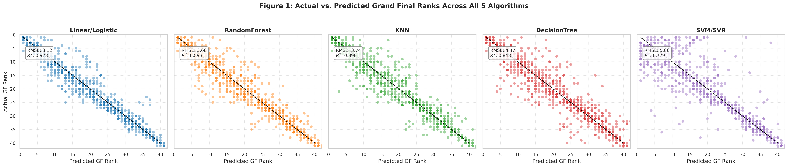
Five scatter plots comparing the actual grand final ranking against the predicted ranking for each predictive algorithm A diagonal dashed line represents perfect predictions made by a predictive model The linear and logistic models show the tightest grouping of dots along the dashed line

**Figure 2 Performance Metrics Summary Across Predictive Architectures**
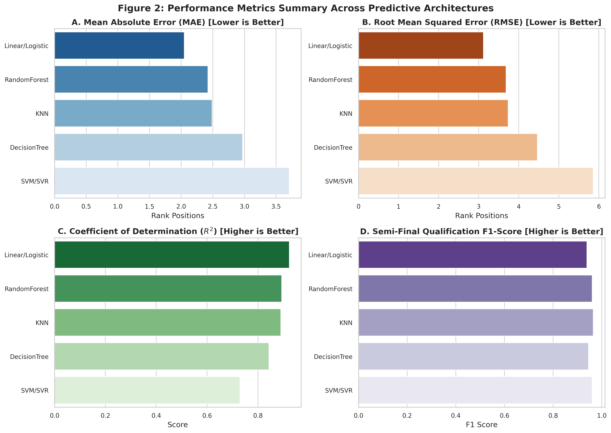
A grid of four horizontal bar charts plotting the measuring metrics used to measure the errors The linear and logistic model consistently beats the others by having the lowest error bars for Mean Absolute Error and Root Mean Squared Error while having the highest accuracy bars for Coefficient of Determination

**Figure 3 Placement Threshold Precision Rates**
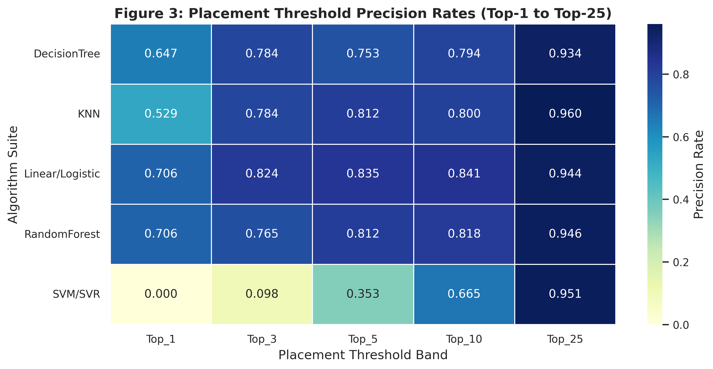
A heatmap table displaying how accurately each algorithm predicts a country finishing in the Top 1 Top 3 Top 5 Top 10 and Top 25 The linear and random forest models achieve the highest accuracy for guessing the exact winner

**Figure 4 Longitudinal Prediction Error Across Eurovision Voting Eras**
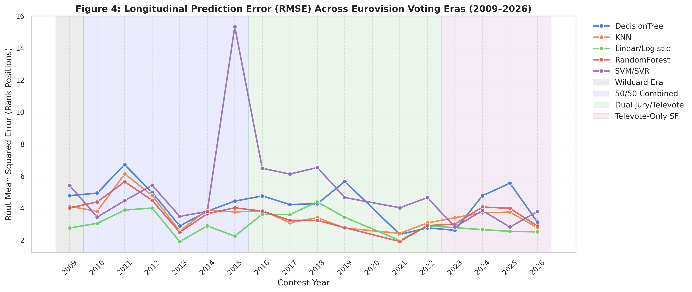
A line chart tracking the prediction error of all five models over time from 2009 to 2026 Background shading shows different historical voting eras like the wildcard era and the combined voting era 

**Figure 5 Top 10 Hardest and Easiest Countries to Predict**
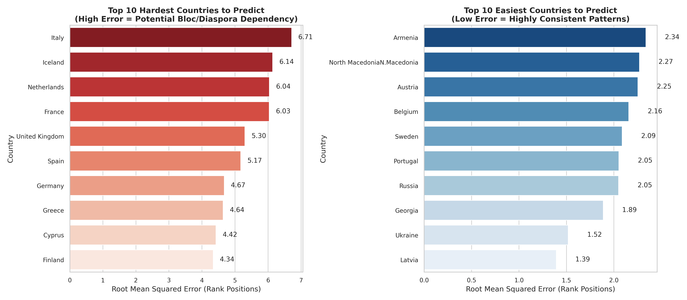
Two horizontal bar charts showing prediction error grouped by country Italy is the hardest to predict with the highest error while Latvia and Ukraine are the easiest to predict with the lowest error

**Figure 6 Structural Disadvantage of Automatic Qualifiers**
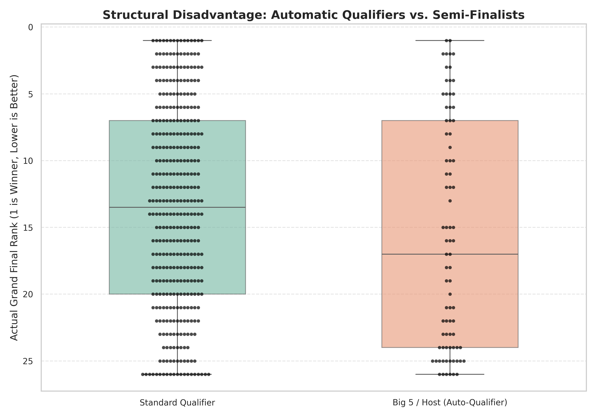
A box plot comparing the final ranks of standard qualifying countries against automatic qualifiers like the Big 5 and the host country It visualizes a structural disadvantage for countries that do not perform in the semi finals

**Figure 7 Historical Regional Competitiveness Trajectories**
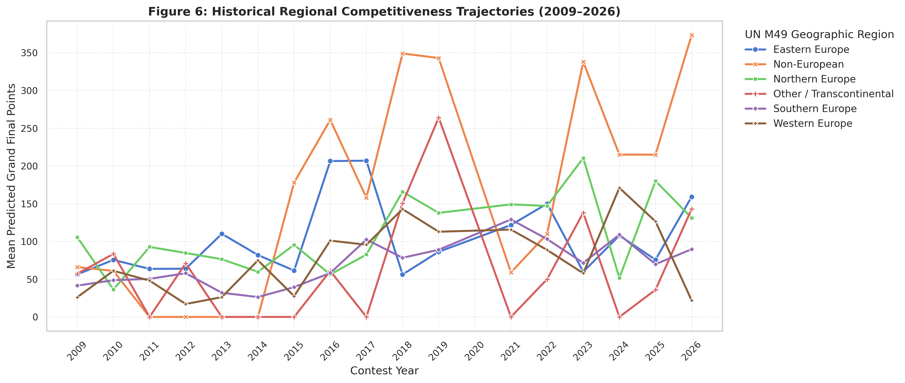
A line chart displaying the average predicted points for different geographic regions from 2009 to 2026 Western Europe shows extreme changes with massive scoring spikes while Northern Europe remains stable

**Figure 8 Score Decay Profile Across Grand Final Ranks**
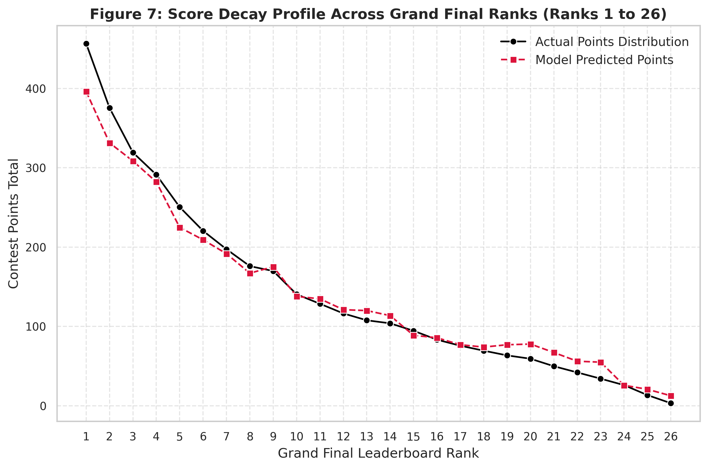
A line chart plotting the actual awarded points and the model predicted points against the final leaderboard rank The curve shows an extreme drop off from first place down to third place before flattening into a long tail

**Figure 9 Critical Difference Diagram**
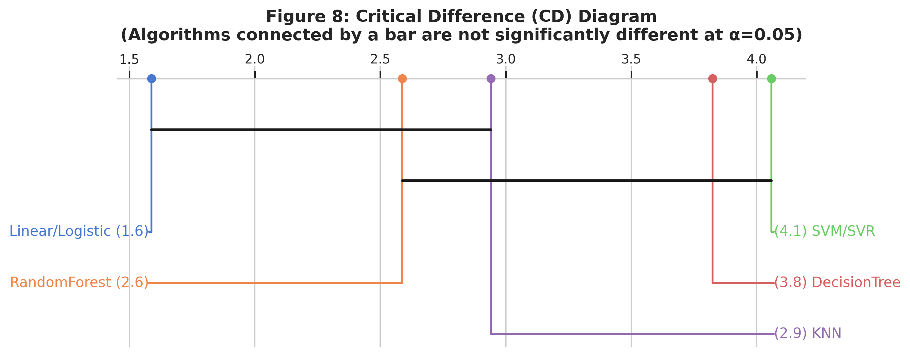
A diagram connecting different algorithms with a horizontal bar if their performance is not statistically different The linear model has the best average rank and is completely isolated on the left side

**Figure 10 Advanced Ranking Performance for NDCG and MRR**
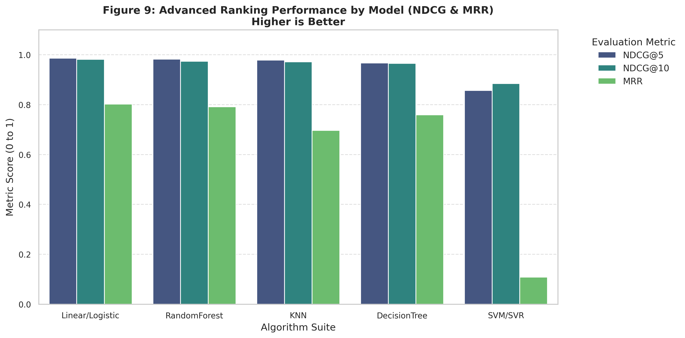
A grouped bar chart grading the models based on advanced search engine ranking metrics The linear and random forest models perform the highest scoring near a perfect 1.0

**Figure 11 SHAP Summary Plot for Feature Impact**
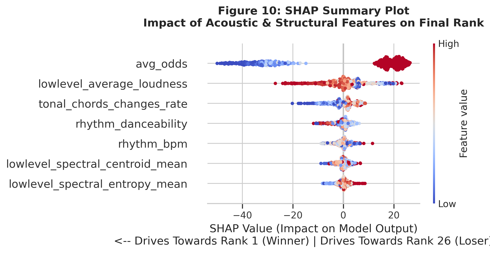
A beeswarm plot showing how much each data feature changes the final prediction High values for betting odds strongly push the model to predict a worse rank proving that betting underdogs are heavily punished by the algorithm

**Figure 12 Feature Ablation Study on Error Penalty**
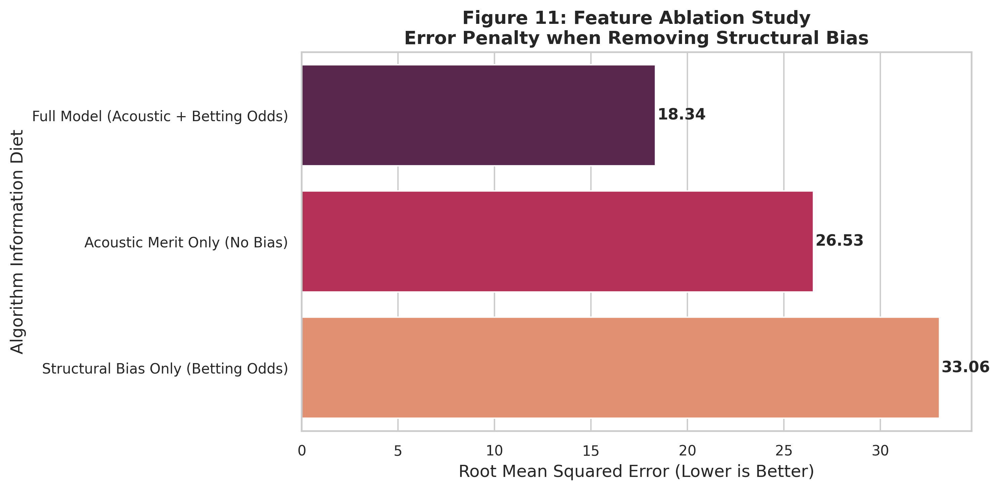
A horizontal bar chart showing the Root Mean Squared Error when certain data types are removed Forcing the model to only look at music increases the error significantly while relying only on betting odds produces the worst possible error

## Modeling Code

The Python notebooks used to process the data and run the machine learning algorithms can be found in the `notebooks` directory The study utilizes Scikit Learn for the core algorithms SHAP for model interpretability and Scikit Posthocs for statistical significance testing

## Cite

When using these materials or datasets please cite the following resources

**Paper**
```bibtex
@unpublished{eurovision_predictive_algorithms,
    author       = {Charles David Ticwala, Joshua Jared Tabilin, and Adrian Mark Varona},
    title        = {Comparative Study of Five Predictive Algorithms for {Eurovision Song Contest} Results},
    note         = {Bachelor of Science in Computer Science Undergraduate Project},
    institution    = {University of the Cordilleras},
    year         = 2026,
    address      = {Baguio City, Philippines}
}
